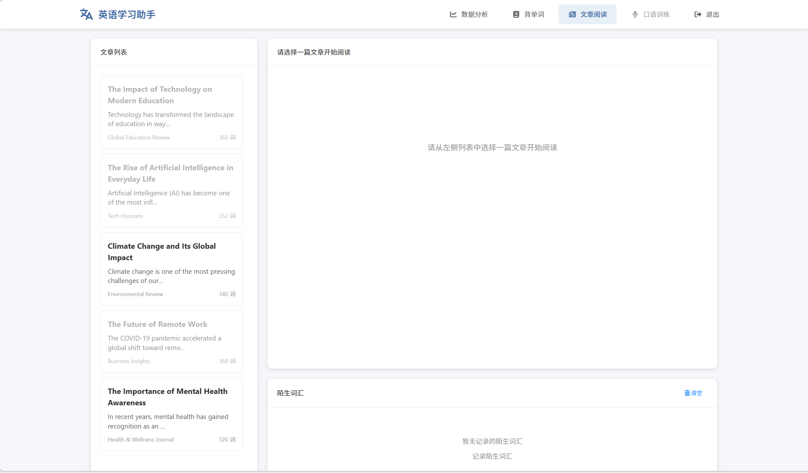

# memory

#### 介绍

**主页内容（数据展示）**

**背单词界面**

**文章阅读**

**小屏幕适配**

以上是该产品的页面的展示

本产品目的在于提高大家的英语水平，主要有两大功能
1. 艾宾浩斯记忆曲线记忆单词
2. 纯英文阅读
    1. 陌生单词可以直接点击查询，以纯英语的解释返回
    2. 每篇文章下，都能展示该篇添加的陌生词汇

3. 主页（数据展现）
    本界面对用户学习进行一个量化分析，以助于提高用户学习反馈

#### 待开发功能

1. 上传文章功能，支持txt，pdf，word等多种文件
2. 支持用户添加自己的英语单词本
3. 连通微信服务号，可以推送最近的陌生词汇，以及今日背诵的单词，便于使用碎片化的时间
4. 本地化知识库的扩建

#### 杂记

1. 折腾完6.S081后，将其部署在云端，方便使用

#### 安装教程

#### 使用说明

